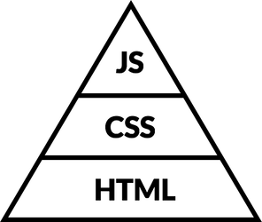

# Front-end Development

We've covered a lot of things in this module, but HTML is just the beginning. Every web page is made up of HTML, CSS, and JavaScript. Here's how these three pieces fit together.

The structure of every web page looks a bit like this. It's a triangle because the balance should mostly be like that: lots of HTML, quite a lot of CSS, and as little JavaScript as possible.

At the base you have your **HTML**. It's the **structured content** of the page: headings, paragraphs, images, videos.

On top of that you have your **CSS**. This handles the **presentation**: colours, fonts, layout. Note that it's a separate layer: see, there's a line there and everything. It exists apart from the structure and content (the HTML) of the page.

At the top, in the tiny triangle, is the **JavaScript** (JS). This adds behaviour and interactions to the page. It's the most fragile part of the three. An error in the code (perhaps introduced at midnight by a sleepy developer as a "quick fix") can break the whole block of the JS.

## What's next?

* For more on HTML5, its history, and the new elements, read through [HTML5 For Web Designers](https://html5forwebdesigners.com/) by [Jeremy Keith](https://adactio.com/).
* For some big ideas and big words about The Right Way To Front-end, have a look though the [Front-end Field guide](http://fefg.projectcodex.co/).
* [Intro to Front-end Development](http://fintro.projectcodex.co/) has a handful of hand-picked resources that will help you learn more HTML, CSS, and JavaScript.
* [Grids](http://grid.projectcodex.co/) looks at how to set up and use a grid system for layout.
* [Front-end Frameworks](http://fef.projectcodex.co/) looks at options for frameworks and the pros and cons of using them.
